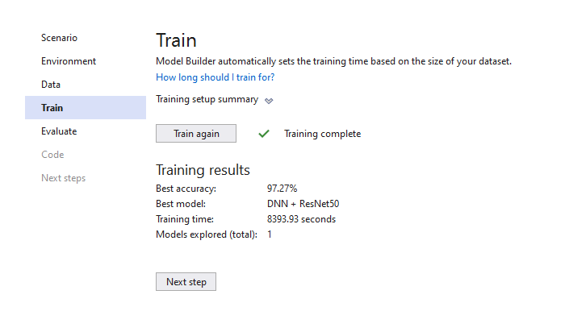

# MNIST-HandwrittenDigitWithML.NET
MNIST - Handwritten Digit Classification Example

## Experiment Results

| Summary |
| --- |
|ML Task: image-classification |
|Dataset: C:\Users\La Quoc Thang\AppData\Local\Temp\a0b341f5-52c1-4617-b58e-c735a2d37a73.tsv |
|Label : Label |
|Total experiment time : 8393.9279076 Secs |
|Total number of models explored: 1 |

## Top 1 models explored

| # | Trainer | MicroAccuracy | MacroAccuracy | Duration| #Iteration |
| --- | --- | --- | --- | --- | --- |
|1 | ImageClassification | 0.9727 | 0.9723 | 8393.9 | 1 |

